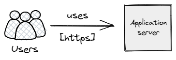

# crud-clubes

A CRUD (Create, Retrieve, Update, Delete) application around a Rent-A-Car Service

## C4 Model

### L1



### L2


### L3


## Getting started

Install dependecies with `npm install`

Once installed, rename the `.env.dist` file to `.env` and edit the `KEY=VALUES` according to your use case.

To run the proyect:

```
npm run start # corre el proyecto en modo producción
npm run dev # corre el proyecto en modo desarrollo
npm run schema:sync # sincroniza la base de datos de sesión y la base de datos principal con los modelos definidos
npm run test # corre tests de jest y recolecta el code coverage
npm run test:dev # corre tests de jest de manera continua (watch)
npm run test:ui # corre pruebas de interfaz en modo "headless"
npm run test:ui:dev # corre pruebas de interfaz con un navegador con el que se puede interactuar
npm run test:integration # corre pruebas de newman (postman)
```

## Proyect structure

Adapted from https://softwareontheroad.com/ideal-nodejs-project-structure/

| Path                          | Description                                                                             |
| ----------------------------- | --------------------------------------------------------------------------------------- |
| data                          | SQLite databases folder                                                                 |
| data/database.db              | Main database                                                                           |
| public/img                    | Stores the static image files used by the server, here the images of the cars are saved |
| src                           | Contains the application                                                                |
| src/index.js                  | Entry point of the applicaition                                                         |
| src/app.js                    | Configuration of the application                                                        |
| src/config/di.js              | Dependency Injection manager                                                            |
| src/module                    | Contains the modules of the application                                                 |
| src/module/view               | Contains the views of the application                                                   |
| src/module/view/layout        | Contains the diferrent layouts                                                          |
| src/module/view/main.njk      | Main view of the application                                                            |
| src/module/car                | Car module                                                                              |
| src/module/car/controller     | Handles http petitions and responses                                                    |
| src/module/car/entity         | Entity of the model                                                                     |
| src/module/car/repository     | Interacts with the database and the files                                               |
| src/module/car/service        | Logic of the module                                                                     |
| src/module/club/car.module.js | Entry point to the module                                                               |

